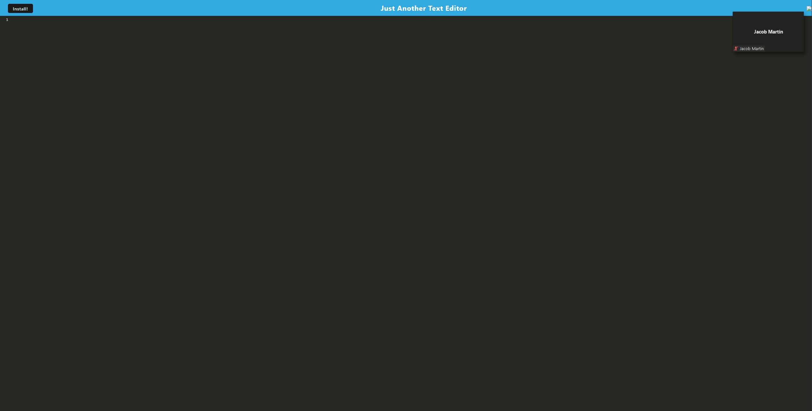

# README

## Description
A progressive web application text editor so you can write what you want on the go. Able to be installed to your machine, local changes are cached while offline and loaded to the server once reconnected.

## Table of Contents
- [Installation](#installation)
- [Usage](#usage)
- [Credits](#credits)
- [License](#license)
- [Questions](#questions)

## Installation
Download from https://rhubarb-custard-23076.herokuapp.com/

## Usage
 Use on the device of your choice after download

## Credits
SleepyJake18

## License 

Licensed under the [MIT](https://opensource.org/licenses/MIT) license
## Tests
N/A

## Questions
[SleepyJake18](https://github.com/SleepyJake18) 

[jsmartin01@gmail.com](mailto:jsmartin01@gmail.com)
